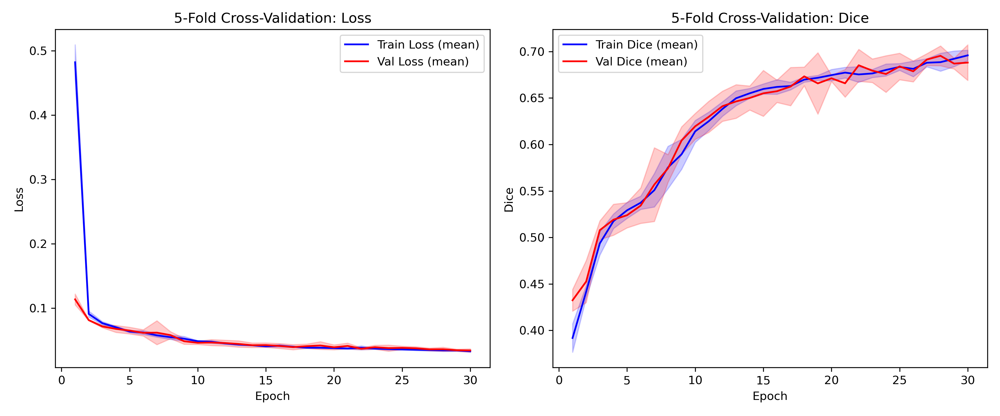
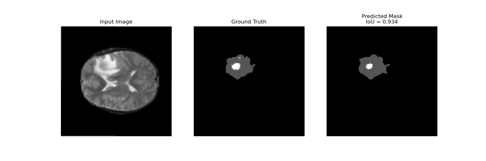
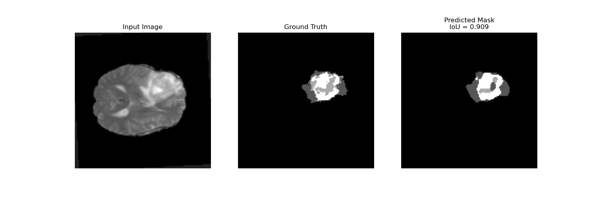
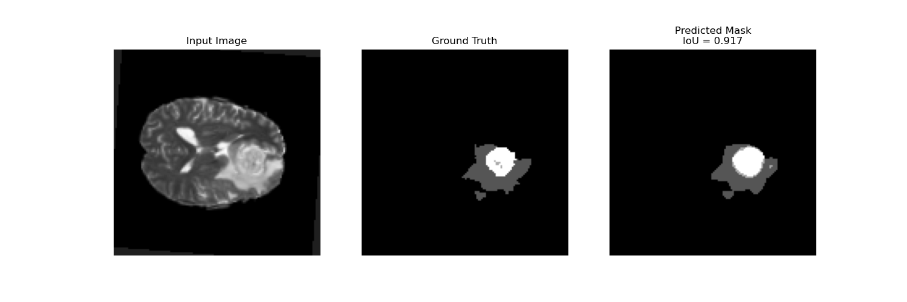

# UNet-Brain-Tumor-Segmentation

This project focused on brain tumor segmentation task on Medical Segmentation Decathlon BraTS dataset with U-Net.

## Get Started

### Environment Setup

Set up the Python environment for the project:

```
# Create and activate conda environment
conda create -n brain_seg python==3.11
conda activate brain_seg

# Install dependencies
pip install -r requirements.txt
```

### Train & Evaluate

Run the notebook to train & evaluate the model.

## Results

### Loss & Dice over Epochs



### Inference Examples







